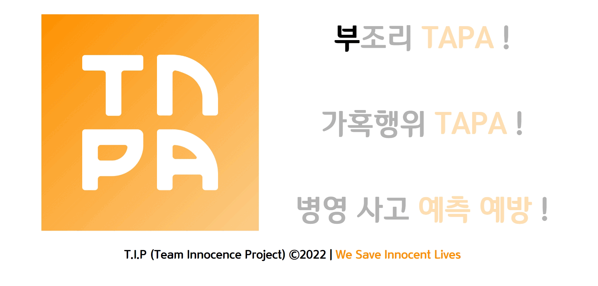

<h1 align="center">TAPA</h1>

<p align="center">
    
</p>
<p align="center">
	<a href="https://tapa-1.gitbook.io/tapa-./">
		
	</a>
	<a href="https://www.notion.so/oxcarxierra/OSAM-c776ec4881834059bac27abebb713d3a">
		
	</a>
</p>

<p align="center">
	<a href="https://github.com/osamhack2022-v2/APP_TAPA_T.I.P/search?l=TSX&type=code"></a>
	<a href="https://github.com/osamhack2022-v2/APP_TAPA_T.I.P/graphs/contributors"></a>
	<a href="https://github.com/osamhack2022-v2/APP_TAPA_T.I.P/stargazers"></a>
	<a href="https://github.com/osamhack2022-v2/APP_TAPA_T.I.Pn/network"></a>
	<a href="https://github.com/osamhack2022-v2/APP_TAPA_T.I.P/blob/master/LICENSE"></a>
</p>

## 목차

<details open="open">
  <ol>
    <li><a href="#overview"> ➤ 프로젝트 개요 (Overview)</a></li>
    <li><a href="#features"> ➤ 기능 스케치 </a></li>
    <li><a href="#benefits"> ➤ 군, TAPA 전과 후로 나뉘다 </a></li>
    <li><a href="#userflow"> ➤ 유저 플로우 </a></li>
    <li><a href="#progress"> ➤ 우리 팀의 협업 과정 </a></li>   
    <li><a href="#prerequisites"> ➤ 컴퓨터 구성 / 필수 조건 안내 (Prerequisites)</a></li>
    <li><a href="#stacks"> ➤ 사용한 기술 스택 (Techniques Used) </a></li>
    <li><a href="#install"> ➤ 프로젝트 사용법 (Getting Started)</a></li>
    <li><a href="#team"> ➤ 팀 정보 (Team Information)</a></li>
    <li><a href="#license"> ➤ 저작권 및 사용권 정보 (Copyleft / End User License)</a></li>
  </ol>
</details>

<h2 id="overview"> :monocle_face: 1. 프로젝트 개요 (Overview) </h2>

>TAPA는 AI 기반 **병영 부조리 사고 예측** 및 예방 솔루션입니다.
### 🌻 개발 동기
3년 전 같은 과 선배가 군대에서 병영 부조리와 과도한 당직 업무 스트레스로 인해 자살로 생을 마감했다는 [뉴스](https://www.joongang.co.kr/article/25077377#home)가 몇 달 전 화제가 되었습니다. 이 사건을 통해 **병영 사고라는 것이 멀리 떨어져 있는 일이 아니라, 정말 가까이에서 벌어질 수 있는 일**이라는 것을 깨달았습니다.

그리고 이러한 *끔찍한 사고가 다시는 일어나지 않도록* 부조리, 가혹행위를 사전에 예측하여 조치를 취해 병영 사고를 예방하고 싶었습니다.

### :rocket: 우리의 미션 (Mission)

저희 TAPA 프로젝트 및 앱의 미션은
**“병사들의 안위와 건강을 위협하는 병영 부조리(가혹행위)의 효율적인 예방 및 대처를 통한 인명 피해 감소”** 입니다.

<h2 id="features"> :iphone: 2. 기능 스케치 </h2>

**TAPA**의 모든 기능은 다음 세 가지 목표 중 한 가지 이상을 달성하기 위해 설계되었습니다.

>**첫째**, 부조리, 가혹행위 등 부당한 일을 당한 병사를 도와주어 *부조리에 효과적으로 대처*하는 것,
- [또래 장병 커뮤니티 소통 기능](https://tapa-1.gitbook.io/tapa-./features/undefined)
- [전문가 상담 및 매칭, DM 기능](https://tapa-1.gitbook.io/tapa-./features/dm)

>**둘째**, 모인 데이터를 바탕으로 *병영 사고를 예측하고 예방*하는 것,
- [AI 기반 처벌 수위 예측 서비스](https://tapa-1.gitbook.io/tapa-./features/ai)
- [NLP 활용 다중 감정 분석 서비스](https://tapa-1.gitbook.io/tapa-./features/nlp)

>**셋째**, 군 차원에서 *병사들의 정신 건강 상태를 관리*하고 앱 사용을 장려하는 것 입니다.
- [통계 및 리더보드 시각화 서비스](https://tapa-1.gitbook.io/tapa-./features/undefined-1)
- [앱 사용 인센티브 부여 기능](https://tapa-1.gitbook.io/tapa-./features/undefined-2)

<h2 id="benefits"> ⚔️ 3. 군, TAPA 전과 후로 나뉘다 </h2>

### 기대 효과
**To Be Added**

### 경쟁력
**To Be Added**

### 활용 분야
**To Be Added**

<h2 id="userflow"> :bulb: 4. 유저 플로우 </h2>

### 유저 플로우

**To Be Added**

<h2 id="progress"> :clipboard: 5. 우리 팀의 협업 과정 </h2>

<table align="center">
    <tbody>
	<tr>
   	    <td width="50%">
	    	<h4 align="center">
		<br><br><a href="https://docs.google.com/spreadsheets/d/1zp-69nqf8FW6XucL7nF_fgEJ4Tz38R_EyGi1Nn9n1DE/edit?usp=sharing">I.A(인포메이션 아키텍쳐)</a></h4>
	    </td>
   	    <td width="50%">
	    	<h4 align="center">
		<br><br><a href="https://tapa22.slack.com/">Slack을 통한 소통</a></h4>
	    </td>
    	</tr>
	<tr>
   	    <td width="50%">
	    	<p align="center">Google Spreadsheet을 이용해 초창기 앱의 기획 구조를 작성해 보았습니다.</p>
	    </td>
   	    <td width="50%">
	    	<p align="center">Slack을 활용해 ML/Front/Back/Design 각 분야별로 소통 창구를 마련하고, 팀원 모두가 상호 협조적인 자세로 서로의 작업을 피드백하고 응원했습니다.</p>
	    </td>
    	</tr>
	<tr>
   	    <td width="50%">
	    	<h4 align="center">
		<h4 align="center">
		<br><br><a href="https://www.figma.com/file/g7vSDk24I0zirYffGMAA3Z/TAPA-UI%2FUX?node-id=1441%3A585">UI/UX 와이어프레임</a></h4>
	    </td>
   	    <td width="50%">
	    	<h4 align="center">
		<br><br><br><a href="https://www.notion.so/oxcarxierra/TO-DO-Lists-819ccd9a5a724bcebd801ef0e28f7df3">칸반 보드</a></h4>
	    </td>
    	</tr>
	<tr>
   	    <td width="50%">
	    	<p align="center">Figma를 이용해 앱의 뼈대가 될 UI/UX의 프로토타입과 와이어프레임을 디자인해 보았습니다.</p>
	    </td>
   	    <td width="50%">
	    	<p align="center">Notion의 칸반 보드를 이용해 진행 중인 작업을 시각화하였습니다. 주로 1~2주일 단위의 스프린트로 주어진 문제를 해결해 나갔습니다</p>
	    </td>
    	</tr>
	<tr>
   	    <td width="50%">
	    	<h4 align="center">
		<br><br><br><br><br><a href="https://dbdiagram.io/d/6329c9c50911f91ba5f5095b/?utm_source=dbdiagram_embed&utm_medium=bottom_open">Database 설계</a></h4>
	    </td>
   	    <td width="50%">
	    	<h4 align="center">
		<br><br><a href="https://www.notion.so/oxcarxierra/API-Documentation-098de65b04484c35a5e810595cc96db5">API 문서화</a></h4>
	    </td>
    	</tr>
	<tr>
   	    <td width="50%">
	    	<p align="center">dbdiagram.io 를 이용해 데이터베이스 구성을 시각화한 ER 다이어그램(Entity Relationship Diagram)을 그려 보았습니다.</p>
	    </td>
   	    <td width="50%">
	    	<p align="center">프론트-백 간의 원활한 협업을 위해 개발하면서 필요한 API 목록을 Notion API Documentation 페이지를 만들어 구체적으로 기록하였습니다.</p>
	    </td>
    	</tr>
	<tr>
   	    <td width="50%">
	    	<h4 align="center">
		<a href="https://github.com/osamhack2022/APP_TAPA_T.I.P/actions">서버 배포 자동화</a></h4>
	    </td>
   	    <td width="50%">
	    	<h4 align="center">
		<a href="https://www.postman.com/restless-equinox-690545-1/workspace/tapa-tip/request/12977747-a87ac77d-93b4-4e4e-b233-85661eab7f48">API 테스트</a></h4>
	    </td>
    	</tr>
	<tr>
   	    <td width="50%">
	    	<p align="center">dbdiagram.io 를 이용해 데이터베이스 구성을 시각화한 ER 다이어그램(Entity Relationship Diagram)을 그려 보았습니다.</p>
	    </td>
   	    <td width="50%">
	    	<p align="center">개발한 API 실행이 되는지 확인 및 테스트할 수 있도록 도와주며, 프런트 및 백이 어디서든지 API 작동여부를 확인할 수 있습니다.</p>
	    </td>
    	</tr>	
    </tbody>
</table>

<h2 id="prerequisites"> :desktop_computer: 6. 컴퓨터 구성 / 필수 조건 안내 (Prerequisites) </h2>

- ECMAScript 6 지원 브라우저 사용
- 권장: Google Chrome 버젼 77 이상

<h2 id="stacks"> :octocat: 7. 사용한 기술 스택 (Techniques Used) </h2>

### Front-end

- Expo

### Server(back-end)

 내 App Engine을 활용해 API 서버를 배포했습니다. 서버 URL은 https://tapa-tip.du.r.appspot.com/ 입니다.

 을 활용해 제공된 VM 서버로 AI 코드를 배포했습니다. 서버 URL은 http://20.214.182.219:8080 입니다. 

### ML

- Pytorch
- KoBERT
- Tensorflow (To be Used)

<h2 id="install"> :hammer_and_wrench: 8. 프로젝트 사용법 (Getting Started) </h2>

### 다운로드 및 패키지 설치 안내
```bash
$ git clone git 주소
$ yarn or npm install
$ yarn start or npm run start
```
**To Be Added**

<h2 id="team"> :family_man_man_girl_boy: 9. 팀 정보 (Team Information) </h2>

|  팀원  |         소속          |     역할     |     GitHub     |         Email         |
| :----: | :-------------------: | :------------: | :------------: | :-------------------: |
| 이재훈 |  국군지휘통신사령부   | PM, ML | jaehoonlee0829 |    xrong@naver.com    |
| 오승석 | 주한미8군한국군지원단 | Frontend |  oxcarxierra   | oxcarxierra@gmail.com |
| 최용훈 |      공군 2여단       | UI/UX Design |    ygr4789     | yonghunjoe@gmail.com  |
| 민거홍 | 주한미8군한국군지원단 | Backend |  placidmoon1   | placidmoon1@gmail.com |
| 임정우 |      육군 15사단      | Backend |   realizedd    | themcman12@gmail.com  |
| 신은수 |  육군 제2작전사령부   | Frontend |     esinx      |     me@esinx.net      |
| 이민석 |    공군 작전사령부    | Frontend |    mscwrd02    | ehdtodvodl@naver.com  |

<h2 id="license"> :scroll: 10. 저작권 및 사용권 정보 (Copyleft / End User License) </h2>
- [MIT](https://github.com/osam2020-WEB/Sample-ProjectName-TeamName/blob/master/license.md)

This project is licensed under the terms of the MIT license.

