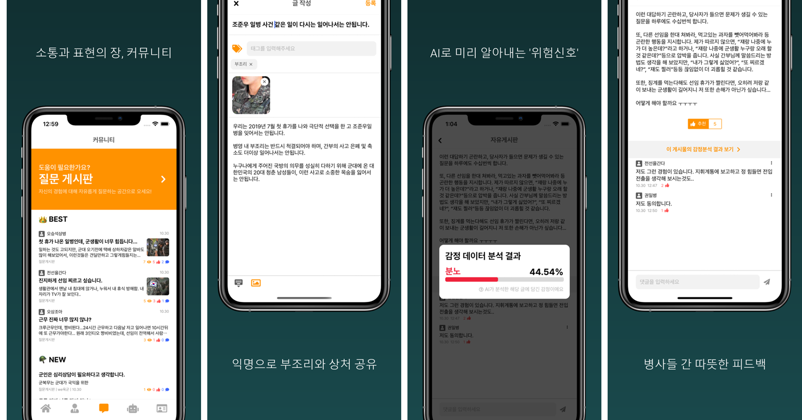
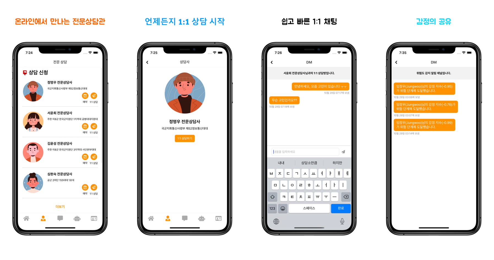
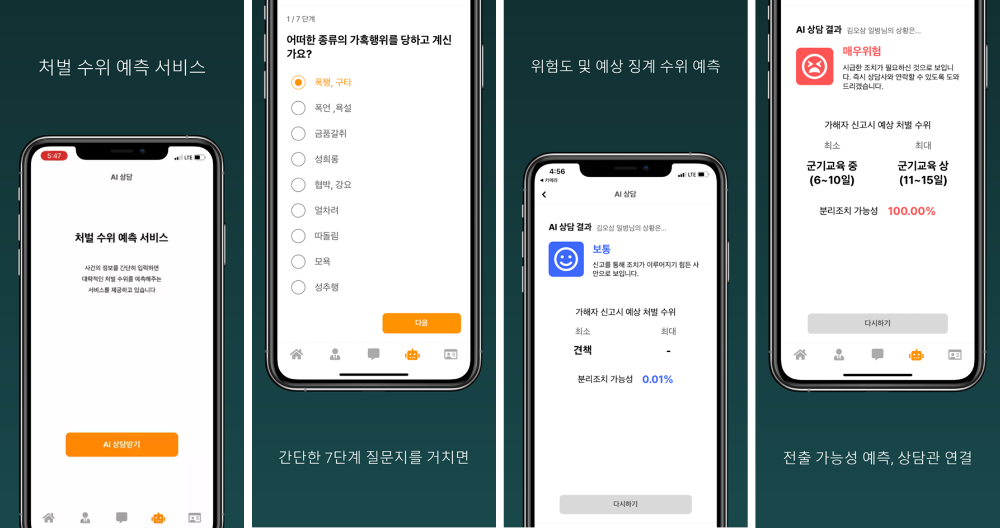
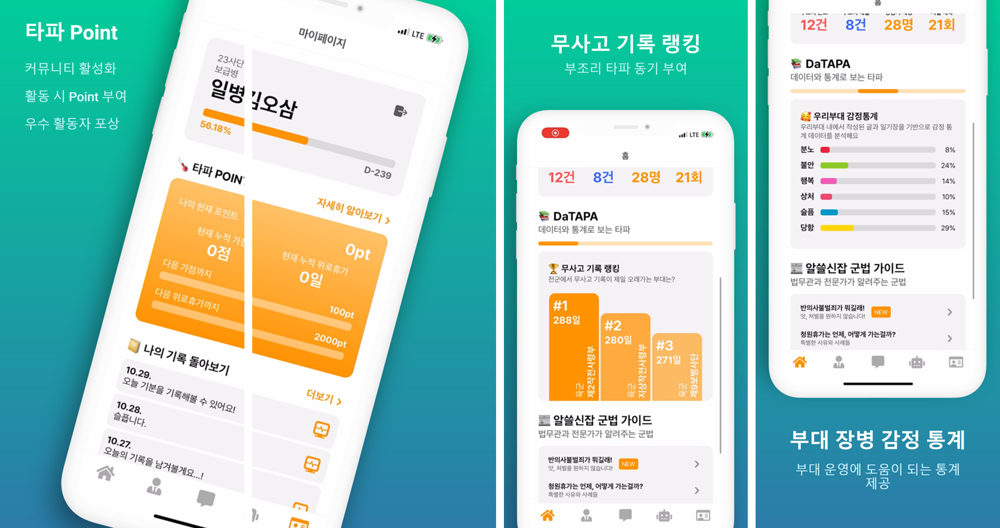

<h1 align="center">TAPA</h1>

<p align="center">
    
</p>
<p align="center">
	<a href="https://tapa-1.gitbook.io/tapa-./">
		
	</a>
	<a href="https://www.notion.so/oxcarxierra/OSAM-c776ec4881834059bac27abebb713d3a">
		
	</a>
</p>
<p align="center">
	<a href="https://github.com/osamhack2022-v2/APP_TAPA_T.I.P/search?l=TSX&type=code"></a>
	<a href="https://github.com/osamhack2022-v2/APP_TAPA_T.I.P/graphs/contributors"></a>
	<a href="https://github.com/osamhack2022-v2/APP_TAPA_T.I.P/stargazers"></a>
	<a href="https://github.com/osamhack2022-v2/APP_TAPA_T.I.Pn/network"></a>
	<a href="https://github.com/osamhack2022-v2/APP_TAPA_T.I.P/blob/master/LICENSE"></a>
</p>

## 목차

<details open="open">
  <ol>
    <li><a href="#overview"> ◈ 프로젝트 개요 (Overview)</a></li>
    <li><a href="#features"> ◈ 기능 스케치 </a></li>
    <li><a href="#benefits"> ◈ 군, TAPA 전과 후로 나뉘다 </a></li>
    <li><a href="#userflow"> ◈ 유저 플로우 </a></li>
    <li><a href="#progress"> ◈ 우리 팀의 협업 과정 </a></li>   
    <li><a href="#prerequisites"> ◈ 컴퓨터 구성 / 필수 조건 안내 (Prerequisites)</a></li>
    <li><a href="#stacks"> ◈ 사용한 기술 스택 (Techniques Used) </a></li>
    <li><a href="#install"> ◈ 프로젝트 사용법 (Getting Started)</a></li>
    <li><a href="#team"> ◈ 팀 정보 (Team Information)</a></li>
    <li><a href="#license"> ◈ 저작권 및 사용권 정보 (Copyleft / End User License)</a></li>
  </ol>
</details>

<h2 id="overview"> :monocle_face: 1. 프로젝트 개요 (Overview) </h2>

>TAPA는 AI 기반 **병영 부조리 사고 예측** 및 예방 솔루션입니다.
<p align="center">
	
</p>

### 🌻 개발 동기
3년 전 같은 과 선배가 군대에서 병영 부조리와 과도한 당직 업무 스트레스로 인해 [스스로 생을 마감했다는 뉴스](https://www.joongang.co.kr/article/25077377#home)가 몇 달 전 화제가 되었습니다. 이 사건을 통해 **병영 사고라는 것이 멀리 떨어져 있는 일이 아니라, 정말 가까이에서 벌어질 수 있는 일**이라는 것을 깨달았습니다.

그리고 이러한 *끔찍한 사고가 다시는 일어나지 않도록* 부조리, 가혹행위를 사전에 예측하여 조치를 취해 병영 사고를 예방하고 싶었습니다.

<p align="center">
	
</p>

### :earth_africa: 개발 배경
<p align="center">
	
</p>

### :rocket: 우리의 미션 (Mission)

저희 TAPA 프로젝트 및 앱의 미션은
**“병사들의 안위와 건강을 위협하는 병영 부조리(가혹행위)의 효율적인 예방 및 대처를 통한 인명 피해 감소”** 입니다.

<h2 id="features"> :iphone: 2. 기능 스케치 </h2>

### 회원가입
- 이름 / 닉네임 / 이메일 / 비밀번호 / 군번 / 계급 / 보직 / 소속부대 / 입대일 / 전역일 을 입력합니다.


### 메인 기능
**TAPA**의 모든 기능은 다음 세 가지 목표 중 한 가지 이상을 달성하기 위해 설계되었습니다.

◈ 스크롤을 내리면 대략적인 UI/UX 스케치를, 파란 글씨(링크)를 클릭하시면 Gitbook에서 상세 설명을 보실 수 있습니다.

>**첫째**, 부조리, 가혹행위 등 부당한 일을 당한 병사를 도와주어 *부조리에 효과적으로 대처*하는 것,
- [또래 장병 커뮤니티 소통 기능](https://tapa-1.gitbook.io/tapa-./features/undefined-1)
- [전문가 상담 및 매칭, DM 기능](https://tapa-1.gitbook.io/tapa-./features/dm)

>**둘째**, 모인 데이터를 바탕으로 *병영 사고를 예측하고 예방*하는 것,
- [AI 기반 처벌 수위 예측 서비스](https://tapa-1.gitbook.io/tapa-./features/ai)
- [NLP 활용 다중 감정 분석 서비스](https://tapa-1.gitbook.io/tapa-./features/nlp)

>**셋째**, 군 차원에서 *병사들의 정신 건강 상태를 관리*하고 앱 사용을 장려하는 것 입니다.
- [통계 및 리더보드 시각화 서비스](https://tapa-1.gitbook.io/tapa-./features/undefined-2)
- [앱 사용 인센티브 부여 기능](https://tapa-1.gitbook.io/tapa-./features/point)






<h2 id="benefits"> ⚔️ 3. 군, TAPA 전과 후로 나뉘다 </h2>

### 기대 효과

- **병영 부조리 예측 및 예방**
	- AI 기반 위험도 및 예상 징계 수위 예측 서비스를 통해 병사에게 도움 제공
	- 위험도 높은 게시글 / AI 상담 결과 발생 시 바로 전문가에게 알림 문자 전송
	- 군법 가이드를 통해 진입장벽이 높은 관련 군법을 병사에게 알기 쉽고 친숙하게 제공

- **군(軍) 내 소통의 증가**
	- 커뮤니티를 활용한 병 상호 간 경험 공유와 위로, 공감을 통해 유대감 형성
	- 태그를 활용해 유사한 사례 검색에 용이
	- 전문가 (상담사, 법무관)과의 1대1 상담으로 따뜻한 소통 분위기 형성
	- TAPA 포인트 제도를 활용해 활발한 소통에 대한 인센티브 부여
	
- **용사 정신 건강 상태 개선 및 모니터링 및 실질적, 정신적 도움받기**
	- 부조리 관련 AI / 상담 / 커뮤니티 게시글 많은 부대 확인 가능
	- 무사고 기록 랭킹 등 리더보드 시각화를 통해 부조리 타파에 대한 동기부여
	- 군 관계자에게 다양한 통계 데이터 제공

### 경쟁력

- **맞춤형 기능 제공**
	- 도움이 시급한 병사에게는 1분 내외로 결과를 알려주는 AI 예측 서비스를
	- 비슷한 경험을 한 사람을 찾고 함께 공감을 원하는 병사에게는 커뮤니티 서비스를
	- 전문적인 상담을 통한 문제 해결이 필요한 병사에게는 상담 및 DM 서비스를
	- 이를 비롯해 각 필요에 부합하는 기능이 전부 들어있는, 올-인-원 어플리케이션
	
- **훌륭한 UI/UX**
	- 딱딱하고 보기 불편한 UI 대신 각 페이지마다 직관적이고 눈에 띄는 UI 제공
	- 심리적 안정감을 주는 톤-온-톤 컬러 매치
	- 어디에서도 볼 수 없는, 게시글의 감정을 분석해주는 독특한 커뮤니티 경험 제공

- **공개SW/오픈소스** 
	- 개발 문서의 오픈소스를 넘어, Gitbook과 Notion 페이지를 통한 디테일한 작업 과정 공개
	- API 문서화, DB Diagram, I.A, Prototype 등을 이용한 구체적인 기획 과정 공개

- **확실한 메시지 전달**
	- 대회 수상 이상의 원대한 목표를 가지고 군의 문제를 풀어보고 싶은 열정 있는 멤버들이 모인 팀
	- 고(故) 조준우 일병 등 병영 부조리 사고로 인해 꽃다운 나이에 삶을 등진 수많은 국군 장병들의 넋을 기리고 절대 잊지 말자는 의미를 담은 프로젝트
	- 미션, 비전 설정 이후 이에 부합하도록 기능 개발 및 수정

### 활용 분야 / 추후 확장

- **NLP, AI 모델 오픈소스 활용**
	- Notion 페이지를 통해 풀 모델 및 코드 제공
	- Gitbook 페이지를 통해 데이터 수집부터 가공, 전처리 과정 공개
	
- **군법 길라잡이 확장**
	- 프로젝트 초기에 구상했던 과거 유사한 사례와 처벌, 신고된 사례에 대한 군법 안내 서비스 제공
	- 1303, 마음의 편지 등으로 신고된 부조리 데이터 판례 크롤링 (네이버 지식in 등)

- **MLOps 분야 추후 확장**
	- TAPA AI 위험도 견적 분석 서비스 / 실제 결과를 통해 새로운 데이터셋 확보 가능
	- 확보한 데이터셋을 바탕으로 모델을 재훈련하고 모델 성능을 개선
	- 알림과 자동화 툴을 생성하여 자동 모델 재훈련

<h2 id="userflow"> :bulb: 4. 유저 플로우 </h2>

### 유저 플로우 차트

<p align="center">
	
</p>

<h2 id="progress"> :clipboard: 5. 우리 팀의 협업 과정 </h2>

◈ 사진을 클릭하시면 확대된 원본 이미지를, 파란 글씨를 클릭하시면 해당 링크를 보실 수 있습니다.
<table align="center">
    <tbody>
	<tr>
   	    <td width="50%">
	    	<h4 align="center">
		<br><br><a href="https://docs.google.com/spreadsheets/d/1zp-69nqf8FW6XucL7nF_fgEJ4Tz38R_EyGi1Nn9n1DE/edit?usp=sharing">I.A(인포메이션 아키텍쳐)</a></h4>
	    </td>
   	    <td width="50%">
	    	<h4 align="center">
		<br><br><a href="https://tapa22.slack.com/">Slack을 통한 소통</a></h4>
	    </td>
    	</tr>
	<tr>
   	    <td width="50%">
	    	<p align="center">Google Spreadsheet을 이용해 초창기 앱의 기획 구조를 작성해 보았습니다.</p>
	    </td>
   	    <td width="50%">
	    	<p align="center">Slack을 활용해 ML/Front/Back/Design 각 분야별로 소통 창구를 마련하고, 팀원 모두가 상호 협조적인 자세로 서로의 작업을 피드백하고 응원했습니다.</p>
	    </td>
    	</tr>
	<tr>
   	    <td width="50%">
	    	<h4 align="center">
		<h4 align="center">
		<br><br><a href="https://www.figma.com/file/g7vSDk24I0zirYffGMAA3Z/TAPA-UI%2FUX?node-id=1441%3A585">UI/UX 와이어프레임</a></h4>
	    </td>
   	    <td width="50%">
	    	<h4 align="center">
		<br><br><br><a href="https://www.notion.so/oxcarxierra/TO-DO-Lists-819ccd9a5a724bcebd801ef0e28f7df3">칸반 보드</a></h4>
	    </td>
    	</tr>
	<tr>
   	    <td width="50%">
	    	<p align="center">Figma를 이용해 앱의 뼈대가 될 UI/UX의 프로토타입과 와이어프레임을 디자인해 보았습니다.</p>
	    </td>
   	    <td width="50%">
	    	<p align="center">Notion의 칸반 보드를 이용해 진행 중인 작업을 시각화하였습니다. 주로 1~2주일 단위의 스프린트로 주어진 문제를 해결해 나갔습니다</p>
	    </td>
    	</tr>
	<tr>
   	    <td width="50%">
	    	<h4 align="center">
		<br><br><br><br><br><a href="https://dbdiagram.io/d/6329c9c50911f91ba5f5095b/?utm_source=dbdiagram_embed&utm_medium=bottom_open">Database 설계</a></h4>
	    </td>
   	    <td width="50%">
	    	<h4 align="center">
		<br><br><a href="https://www.notion.so/oxcarxierra/API-Documentation-098de65b04484c35a5e810595cc96db5">API 문서화</a></h4>
	    </td>
    	</tr>
	<tr>
   	    <td width="50%">
	    	<p align="center">dbdiagram.io 를 이용해 데이터베이스 구성을 시각화한 ER 다이어그램(Entity Relationship Diagram)을 그려 보았습니다.</p>
	    </td>
   	    <td width="50%">
	    	<p align="center">프론트-백 간의 원활한 협업을 위해 개발하면서 필요한 API 목록을 Notion API Documentation 페이지를 만들어 구체적으로 기록하였습니다.</p>
	    </td>
    	</tr>
	<tr>
   	    <td width="50%">
	    	<h4 align="center">
		<br><br><a href="https://github.com/osamhack2022/APP_TAPA_T.I.P/actions">서버 배포 자동화</a></h4>
	    </td>
   	    <td width="50%">
	    	<h4 align="center">
		<br><br><a href="https://www.postman.com/restless-equinox-690545-1/workspace/tapa-tip/request/12977747-a87ac77d-93b4-4e4e-b233-85661eab7f48">API 테스트</a></h4>
	    </td>
    	</tr>
	<tr>
   	    <td width="50%">
	    	<p align="center">main.yml을 통해 Github Actions와 Google Cloud를 연계하였습니다. 그 때문에 백엔드 코드를 서버에 수동으로 배포할 필요없이 `server` 브랜치에 push하거나 pull request을 하면 서버에 자동으로 배포하도록 설계했습니다. </p>
	    </td>
   	    <td width="50%">
	    	<p align="center">개발한 API 실행이 되는지 확인 및 테스트할 수 있도록 도와주며, 프런트 및 백이 어디서든지 API 작동여부를 확인할 수 있습니다.</p>
	    </td>
    	</tr>
	<tr>
   	    <td width="50%">
	    	<h4 align="center">
		<br><br><a href="https://github.com/osamhack2022/APP_TAPA_T.I.P/actions">EXPO Build 자동화</a></h4>
	    </td>
   	    <td width="50%">
	    	<h4 align="center">
		<br><br><a href="https://github.com/osamhack2022/APP_TAPA_T.I.P/actions">ESLint 자동화</a></h4>
	    </td>
    	</tr>
	<tr>
   	    <td width="50%">
	    	<p align="center">Github Actions를 활용하여 Expo 빌드 커맨드를 자동으로 실행하여 CI/CD 빌드를 구현했습니다. 모든 PR에 대해서 자동으로 빌드하여 Expo Go Client를 통해 가장 최신 혹은 PR에서 보여주고 싶은 버전의 frontend를 데모로 보여줄 수 있게 했습니다.</p>
	    </td>
   	    <td width="50%">
	    	<p align="center">코드 스타일 통일을 용이하게 하기 위해 ESLint를 CI/CD 과정에 포함시켰습니다.</p>
	    </td>
    	</tr>	
    </tbody>
</table>

<h2 id="prerequisites"> :desktop_computer: 6. 컴퓨터 구성 / 필수 조건 안내 (Prerequisites) </h2>

- ECMAScript 6 지원 브라우저 사용
- 권장: Google Chrome 버젼 77 이상

<h2 id="stacks"> :octocat: 7. 사용한 기술 스택 (Techniques Used) </h2>

### Front-end


### Server(Back-end)

  Google Cloud 내 App Engine을 활용해 API 서버를 배포했습니다. 서버 URL은 https://tapa-tip.du.r.appspot.com/ 입니다.   

  Gunicorn을 활용해 제공된 VM 서버로 AI 코드를 배포했습니다. 서버 URL은 http://20.214.182.219:8080 입니다.   


### ML


<h2 id="install"> :hammer_and_wrench: 8. 프로젝트 사용법 (Getting Started) </h2>

### 다운로드 및 패키지 설치 안내

### Environment Variables (환경변수들)
```
FIREBASE_API_KEY=<firebase api key>
FIREBASE_AUTH_DOMAIN=<firebase auth domain>
FIREBASE_DATABASE_URL=<firebase db url>
FIREBASE_STORAGE_BUCKET=<firebase storage bucket url>
FLASK_SECRET_KEY=<secret key for flask sessions>
CLASSIFIER_SERVER_URL=<AI Backend server url>
ADMIN_ACCOUNT_EMAIL=<email for an account created for administrative purposes>
ADMIN_ACCOUNT_PASSWORD=<password for admin account>
```

### APP Frontend
```console
$ git clone https://github.com/osamhack2022-v2/APP_TAPA_T.I.P.git
$ cd APP(FE)
$ yarn or npm install
$ touch .env
$ vim .env # 위에 서술된 환경변수들 저장
$ npx expo start
```
### APP Backend
```console
$ git clone https://github.com/osamhack2022-v2/APP_TAPA_T.I.P.git
$ vim ~/.bashrc # 위에 서술뒨 환경변수들 추가. rc파일의 이름은 사용자의 쉘에 따라 다를 수 있음.
$ cd APP(BE)
$ python3 -m venv env
$ . env/bin/activate
$ pip install -r requirements.txt
$ python app.py
```
### AI Backend
```console
$ git clone https://github.com/osamhack2022-v2/APP_TAPA_T.I.P.git
$ vim ~/.bashrc # 위에 서술뒨 환경변수들 추가. rc파일의 이름은 사용자의 쉘에 따라 다를 수 있음.
$ cd AI(BE)
$ python3 -m venv env
$ . env/bin/activate
$ pip install -r requirements.txt
$ python app.py
```

<h2 id="team"> :family_man_man_girl_boy: 9. 팀 정보 (Team Information) </h2>

|  팀원  |         소속          |     역할     |     GitHub     |         Email         |
| :----: | :-------------------: | :------------: | :------------: | :-------------------: |
| 이재훈 |  국군지휘통신사령부   | PM, ML | jaehoonlee0829 |    xrong@naver.com    |
| 오승석 | 주한미8군한국군지원단 | Frontend |  oxcarxierra   | oxcarxierra@gmail.com |
| 최용훈 |      공군 2여단       | UI/UX Design |    ygr4789     | yonghunjoe@gmail.com  |
| 민거홍 | 주한미8군한국군지원단 | Backend |  placidmoon1   | placidmoon1@gmail.com |
| 임정우 |      육군 15사단      | Backend |   realizedd    | themcman12@gmail.com  |
| 신은수 |  육군 제2작전사령부   | Frontend |     esinx      |     me@esinx.net      |
| 이민석 |    공군 작전사령부    | Frontend |    mscwrd02    | ehdtodvodl@naver.com  |

<h2 id="license"> :scroll: 10. 저작권 및 사용권 정보 (Copyleft / End User License) </h2>
- [MIT](https://github.com/osam2020-WEB/Sample-ProjectName-TeamName/blob/master/license.md)

This project is licensed under the terms of the MIT license.

AI(BE) 폴더의 NLP 파트 모델은 https://github.com/SKTBrain/KoBERT 의 KoBERT 모델을 활용했습니다.
KoBERT는 `Apache-2.0` 라이선스 하에 공개되어 있습니다. 라이선스 전문은 LICENSE 파일에서 확인하실 수 있습니다.
Copyright (c) 2019 SK T-Brain
